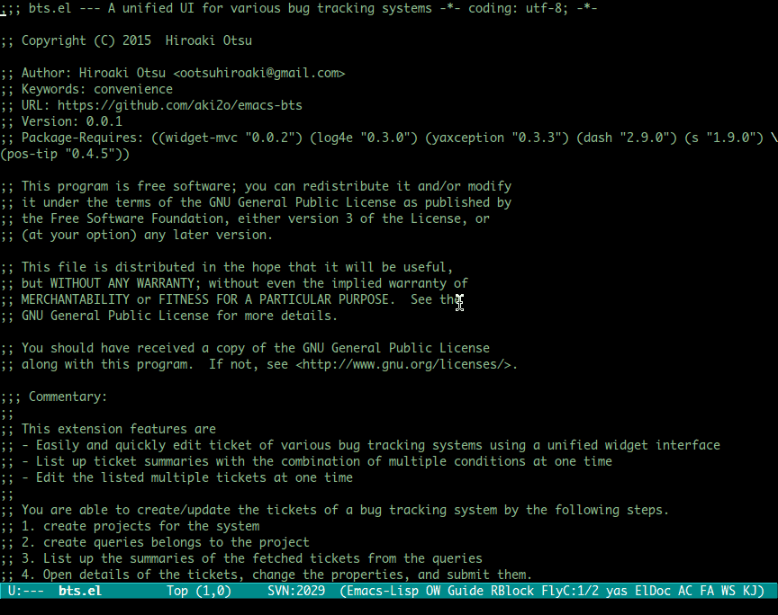

[](https://travis-ci.org/aki2o/emacs-bts)

# What's this?

This is a extension of Emacs that provides a unified interface for various bug tracking systems.  
This works using the plugin for target system.  
At present, there are the following well-known plugins.  
-   

# Demo

Here is a demo using .  



# Feature

-   Easily and quickly edit ticket of various bug tracking systems using a unified widget interface
-   List up ticket summaries with the combination of multiple conditions at one time
-   Edit the listed multiple tickets at one time

# Install

### If use package.el

2015/01/06 Now application

### If use el-get.el

2015/01/06 Now application

### If use auto-install.el

```lisp
(auto-install-from-url "https://raw.github.com/aki2o/emacs-bts/master/bts.el")
```
-   In this case, you need to install each of the following dependency.

### Manually

Download bts.el and put it on your load-path.  
-   In this case, you need to install each of the following dependency.

### Dependency

-   
-   
-   
-   
-   
-   pos-tip.el

# Configuration

```lisp
(require 'bts)

;; Key Binding
(global-unset-key (kbd "M-b"))
(global-set-key (kbd "M-b n")   'bts:ticket-new)
(global-set-key (kbd "M-b s")   'bts:summary-open)
(global-set-key (kbd "M-b p n") 'bts:project-new)
(global-set-key (kbd "M-b p u") 'bts:project-update)
(global-set-key (kbd "M-b p d") 'bts:project-remove)
(global-set-key (kbd "M-b p D") 'bts:project-remove-all)
(global-set-key (kbd "M-b q n") 'bts:query-new)
(global-set-key (kbd "M-b q u") 'bts:query-update)
(global-set-key (kbd "M-b q d") 'bts:query-remove)
(global-set-key (kbd "M-b q D") 'bts:query-remove-all)

;; About other config item, see Customization or eval the following sexp.
;; (customize-group "bts")
```

# Usage

### Setup project

Project means a access configuration for the system stores target tickets data.  
Create and update project using `bts:project-new` / `bts:project-update`.  

### Setup query

Query means a configuration detects the fetched tickets in the tickets belongs to the project.  
Create and update query using `bts:query-new` / `bts:query-update`.  

### Create new ticket

Create a ticket of the system using `bts:ticket-new`.  

### Keymap of widget buffer

Widget buffer is opened for editing project/query/ticket.  
The following keymap is defined in the buffer inherits the standard widget keymap (\*1).  
-   `C-n` bts:widget-forward &#x2026; move to forward widget (\*2)
-   `C-p` bts:widget-backward &#x2026; move to backward widget (\*2)
-   `C-M-j` bts:widget-jump &#x2026; jump to any widget (\*3)
-   `M-RET` bts:widget-submit &#x2026; push submit button
-   `M-DEL` bts:widget-cancel &#x2026; push cancel button

\*1 For checking that, see document of `widget-keymap` / `widget-field-keymap` / `widget-text-keymap`
\*2 If possible, use 
\*3  is required

### List up tickets

The system tickets are listed up by `bts:summary-open`.  
Multiple queries are selectable in a choice of query.  
Then, the summary buffer is opened inherits `tabulated-list-mode`.  
The following keymap is defined in the buffer inherits `tabulated-list-mode-map`.  
-   `j` / `n` next-line &#x2026; move to down entry
-   `k` / `p` previous-line &#x2026; move to up entry
-   `h` / `b` bts:summary-left-column &#x2026; move to left column
-   `l` / `f` bts:summary-right-column &#x2026; move to right column
-   `RET` bts:summary-view-ticket &#x2026; open ticket view (\*1)
-   `m` bts:summary-mark-ticket &#x2026; mark current entry
-   `M` bts:summary-mark-all-tickets &#x2026; mark all entries
-   `u` bts:summary-unmark-ticket &#x2026; unmark current entry
-   `U` / `M-DEL` bts:summary-unmark-all-tickets &#x2026; unmark all entries
-   `t` bts:summary-toggle-ticket-marking &#x2026; toggle current entry mark situation
-   `T` bts:summary-toggle-all-tickets-marking &#x2026; toggle all entries mark situation
-   `g` / `r` bts:summary-reload-ticket &#x2026; fetch the latest data and update current entry
-   `G` / `R` bts:summary-reload-all &#x2026; fetch the latest datas and update all entries (\*2)

\*1 If any entries are marked, target are them (\*3). Else, it's current entry
\*2 The buffer is not updated to latest automatically
\*3 If target is multiple and the system has the function, open multi view (\*4)
\*4 Multi view is able to edit multiple tickets at one time

# Tested On

-   Emacs &#x2026; GNU Emacs 24.3.1 (i686-pc-linux-gnu, GTK+ Version 3.4.2) of 2014-02-22 on chindi10, modified by Debian
-   widget-mvc.el &#x2026; 0.0.2
-   log4e.el &#x2026; 0.3.0
-   yaxception.el &#x2026; 0.3.3
-   dash.el &#x2026; 2.9.0
-   s.el &#x2026; 1.9.0
-   pos-tip.el &#x2026; 0.4.5

**Enjoy!!!**
